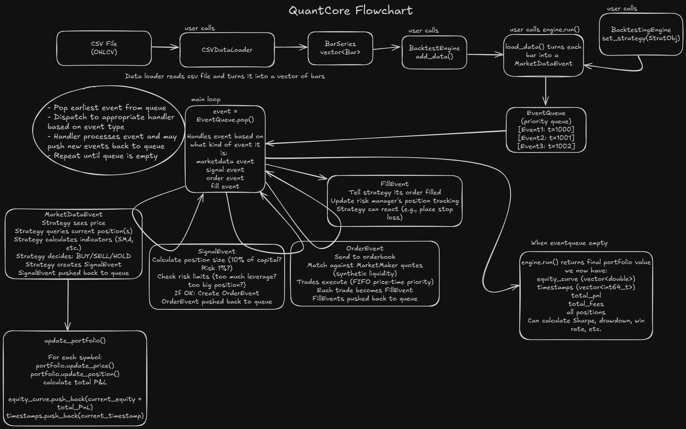

# Architecture

## Overview

QuantCore is split into two layers: a C++20 core that owns all performance-critical logic, and a Python interface for strategy development and research. The two communicate through pybind11 bindings with minimal overhead.

```
┌─────────────────────────────────────────────┐
│               Python Layer                  │
│  Strategy subclass · analytics · plotting   │
├─────────────────────────────────────────────┤
│            pybind11 bindings                │
├─────────────────────────────────────────────┤
│               C++ Core                      │
│  EventQueue · BacktestEngine · OrderBook    │
│  ExecutionEngine · Portfolio · RiskManager  │
└─────────────────────────────────────────────┘
```

---

## Event-Driven Design

The engine is strictly event-driven. Every action (price update, strategy signal, order, fill) enters the same priority queue and is processed in timestamp order. Nothing happens outside the queue.



### Why a priority queue

The queue orders events by `timestamp_ns`. When a strategy generates a signal on bar N, that signal gets a timestamp of bar N. The resulting order and fill cannot appear before bar N's market data event; the queue enforces this mechanically. There is no explicit look-ahead check; temporal ordering is structural.

### Event tie-breaking

When two events share the same timestamp, they are ordered by type:

```
MARKET_DATA < SIGNAL < ORDER < FILL
```

This matches real execution semantics: market data arrives, strategy reacts, order is routed, fill comes back.

---

## Core Components

### EventQueue

`cpp/backtesting/event_queue.h`

A `std::priority_queue` over `EventPtr` with a custom comparator. Events are popped in ascending timestamp order. The comparator uses event type as a secondary key for stable tie-breaking.

All events derive from `Event` (base class holding `EventType` and `int64_t timestamp_ns`). The four concrete types are `MarketDataEvent`, `SignalEvent`, `OrderEvent`, and `FillEvent`.

### BacktestEngine

`cpp/backtesting/backtest_engine.h`

The main loop. Owns the event queue, one `ExecutionEngine` per symbol, and one `PortfolioContext`. On each iteration:

1. Pops the next event.
2. Routes it to the correct handler.
3. Any handler may push new events back into the queue.

The engine is deterministic and reentrant: calling `run()` twice on the same engine produces identical results because internal state is reset at the start of each run.

Bar data and tick data share the same loop. A tick becomes a `MarketDataEvent` with `open == high == low == close == price`, so strategies work unchanged across both data types.

### OrderBook

`cpp/orderbook/`

Integrated from [orderbook-simulator-cpp](https://github.com/SLMolenaar/orderbook-simulator-cpp). Maintains bid and ask sides as sorted price-level maps with FIFO queues at each level. Matching is price-time priority.

Supports: `GoodTillCancel`, `Market`, `ImmediateOrCancel`, `FillOrKill`, `GoodForDay`.

Partial fills are native: a limit order that only partially matches produces a `FillEvent` for the matched quantity and remains on the book for the remainder.

### ExecutionEngine

`cpp/Execution.h`

Sits between the backtest loop and the order book. Applies:

- **Latency**: order submission is delayed by `ExecutionConfig::latency_ns` before reaching the book.
- **Slippage**: fill price is adjusted by `slippage_pct` in the direction of the trade.
- **Fees**: each fill incurs either `maker_fee` or `taker_fee` depending on whether the order added or removed liquidity.

Tracks position and PnL per symbol.

### Portfolio

`cpp/backtesting/portfolio_context.h`

Aggregates positions across all symbols via `PortfolioContext`. Maintains mark-to-market values, available cash, and leverage metrics. The equity curve is recorded by `BacktestEngine` and exposed via `get_equity_curve()`.

In bar mode the equity curve has one entry per bar. In tick mode it is sampled at the interval set by `set_equity_snapshot_interval` (default: every tick, which can produce a very dense curve for large tick datasets).

### RiskManager

`cpp/backtesting/risk_manager.h`

Pre-trade checks run before any order reaches the order book. Checks enforced by `RiskLimits`:

- `max_position_pct`: maximum position value as a fraction of current capital.
- `max_leverage`: maximum total notional / capital.
- `max_loss_pct`: halt trading if drawdown from peak exceeds this threshold.
- `max_order_value`: per-order notional cap.

A rejected order produces a `RiskCheckResponse` with a reason code but does not crash the engine. The strategy simply does not receive a fill.

### PositionSizer

`cpp/backtesting/position_sizer.h`

Abstract base class. The engine calls `calculate_size(PositionSizingContext)` before routing a signal to determine how many shares to order. Available implementations:

| Class | Logic |
|---|---|
| `FixedPercentage` | `capital * pct / price` |
| `RiskBased` | `capital * risk_per_trade / (price * stop_distance)` |
| `KellyCriterion` | Kelly fraction derived from win rate and payoff ratio |
| `EqualWeight` | Allocates `capital / n_positions` per position |
| `VolatilityTargeting` | Scales leverage to hit a target portfolio volatility |
| `FixedShares` | Constant number of shares regardless of capital |

All sizers share `apply_constraints()` which enforces `max_position_size`, `min_position_size`, and `max_leverage`.

---

## Data Pipeline

### Bar data

`CSVDataLoader` reads OHLCV CSV files into a `BarSeries` (a `std::vector<BarData>`). `ParquetDataLoader` (Python-side) reads `.parquet` files and returns the same `List[BarData]`. Both normalize timestamps to nanoseconds since epoch.

Multiple assets are supported: each `add_data(symbol, bars)` call registers an independent series. The engine interleaves events from all series in timestamp order using the priority queue, with no separate merge step.

### Tick data

`TickDataLoader` reads tick CSV files into a `TickSeries` (a `std::vector<TickData>`). `TickParquetLoader` (Python-side) reads `.parquet` files. Each `TickData` holds a symbol, timestamp, price, quantity, and aggressor side.

`add_tick_data(symbol, ticks)` registers a tick series. Bar and tick series can be mixed across symbols in the same engine; each symbol uses whichever type was registered for it.

`TickDataLoader::aggregate_to_bars(ticks, bar_duration_ns)` (C++) and `qc.aggregate_ticks_to_bars(ticks, bar_duration_ns)` (Python) convert a tick series to OHLCV bars of any duration before passing them to the engine, if a strategy is bar-based.

Two engine settings matter specifically for tick mode:

- `set_mm_refresh_interval(ns)`: minimum nanoseconds between market-maker quote refreshes per symbol. Without throttling the MM refreshes on every tick, which dominates cost at high frequencies. A 1-second interval gives ~5x speedup on 1-second tick data.
- `set_equity_snapshot_interval(ns)`: minimum nanoseconds between equity curve snapshots. Defaults to every event, which produces a dense curve. Set to e.g. `60_000_000_000` for 1-minute snapshots.

### Memory

Data is loaded into memory upfront. For the scale QuantCore targets this is a deliberate trade-off: a year of daily bars is under 20 KB; 10 years of minute bars for one asset is around 35 MB. Tick data is denser: a day of 1-second ticks for one symbol is ~27 KB, a year is ~10 MB. Both are well within reason for a research workstation.

---

## Python Bindings

`bindings.cpp` uses pybind11 to expose C++ classes directly. No Python reimplementation of the engine exists. Python strategies run the same C++ loop as C++ strategies.

Strategy subclassing works through pybind11's trampoline pattern: the C++ `Strategy` base declares `on_data` and `on_fill` as virtual, and the trampoline class forwards calls from C++ into the Python subclass. A Python `on_data` method is called from within the C++ event loop with no marshaling overhead for the event itself.

Both `add_data` and `add_tick_data` accept either their respective object lists (`List[BarData]`, `List[TickData]`) or numpy arrays (`(N, 6)` and `(N, 4)` float64 respectively). The numpy path uses a single boundary crossing instead of N individual pybind11 object constructions, giving a 3–5x speedup for large datasets.

The `run_backtest()` and `run_tick_backtest()` convenience functions in `python/quantcore/__init__.py` construct a `BacktestEngine`, load data, attach the strategy, call `engine.run()`, and return a `BacktestResults` object. Call `.compute()` on the result to calculate performance metrics; if a benchmark equity curve is present, benchmark-relative metrics are calculated at the same time.

---

## Design Decisions

### Signal-based strategy API rather than direct order placement

Strategies call `generate_signal(symbol, SignalType, strength, timestamp)`. They do not construct orders. The engine converts signals to orders using the configured `PositionSizer` and `ExecutionConfig`.

Strategies express intent rather than execution mechanics, so position sizing can be swapped without touching strategy code. The same strategy class works for both bar and tick data without modification.

### Single-threaded event loop

The backtest loop is single-threaded. A multi-threaded loop would require synchronization on the event queue and portfolio state, adding complexity and making results harder to reason about. The performance target (1 year of daily data in under 5ms) is met comfortably single-threaded.

Parallelism is available at a higher level: run multiple independent backtests concurrently (e.g. a parameter sweep) using Python's `multiprocessing`. Each backtest owns its own engine with no shared state.

### Reentrant engine

Calling `run()` resets internal state and reruns from the beginning of the loaded data. Configure the engine once, call `run()` in a loop with different strategy parameters, collect results. No need to reconstruct the engine between runs.

### Order book integration

Rather than a simplified fill model (fill at close price +/- slippage), QuantCore routes orders through a real price-time priority order book:

- Partial fills work correctly for limit orders on thin books.
- Spread simulation is natural: a market buy fills at the ask, a market sell at the bid.
- Tick-level strategies (market making, high-frequency mean reversion) get realistic fill mechanics.

The order book is the same codebase as [orderbook-simulator-cpp](https://github.com/SLMolenaar/orderbook-simulator-cpp).

### Market maker throttling for tick data

The synthetic market maker that provides liquidity refreshes its quotes by cancelling all resting orders and re-quoting on every call. For bar data this happens once per bar, which is cheap. For tick data at high frequencies this can dominate total engine cost. The `mm_refresh_interval_ns` setting throttles the refresh rate; `run_tick_backtest()` sets it to 1 second by default.

---

## File Map

```
cpp/
├── Execution.h                  ExecutionEngine (position tracking, fees, slippage)
├── backtesting/
│   ├── event.h                  Event base class and EventType enum
│   ├── event_queue.h            Priority queue over EventPtr
│   ├── market_data_event.h      OHLCV bar event (also used for ticks)
│   ├── signal_event.h           Strategy signal (BUY / SELL / HOLD)
│   ├── order_event.h            Order command sent to execution engine
│   ├── fill_event.h             Execution confirmation
│   ├── bar_data.h               BarData struct and BarSeries typedef
│   ├── tick_data.h              TickData struct and TickSeries typedef
│   ├── tick_data_loader.h       CSV loader and aggregate_to_bars
│   ├── data_loader.h            CSV loader for bar data
│   ├── backtest_engine.h        Main loop and orchestration
│   ├── market_maker.h           Synthetic liquidity provider
│   ├── position_sizer.h         Sizing implementations
│   ├── risk_manager.h           Pre-trade checks
│   ├── portfolio_context.h      Multi-asset portfolio state (PortfolioContext)
│   └── strategy.h               Abstract base with trampoline for pybind11
├── orderbook/                   Limit order book (price-time priority)
├── strategies/
│   ├── buy_and_hold.h
│   ├── sma_crossover.h
│   ├── mean_reversion.h
│   └── pairs_trading.h
└── tests/                       GoogleTest suite

python/
├── bindings.cpp                 pybind11 module definition
├── quantcore/
│   ├── __init__.py              Public API, run_backtest(), run_tick_backtest()
│   ├── analytics.py             Metrics and rolling calculations
│   ├── plotting.py              Matplotlib visualizations
│   ├── position_sizing.py       Python-side sizing utilities
│   ├── parquet_loader.py        Parquet ingestion for bar data
│   ├── tick_parquet_loader.py   Parquet ingestion for tick data
│   ├── corporate_actions.py     Split and dividend adjustment (CorporateActionsAdjuster)
│   ├── calendar.py              Trading calendar filter (TradingCalendar)
│   ├── walk_forward.py          GridSearchOptimizer, WalkForwardAnalyzer, monte_carlo_validation
│   └── _engine_builder.py       Internal helper: builds BacktestEngine from BacktestConfig
└── build_module.py              Build helper

benchmarks/
├── bench_backtest_engine.cpp    Bar data: throughput, latency, memory, targets
├── bench_tick_data.cpp          Tick data: throughput, MM throttle, aggregation
├── bench_python.py              Python layer: bar data benchmarks
├── bench_tick_python.py         Python layer: tick data benchmarks
└── RESULTS.md                   Measured results

examples/
├── mean_reversion.ipynb
├── sma_crossover.ipynb
├── pairs_trading.ipynb
└── build_your_own_strategy.ipynb
```